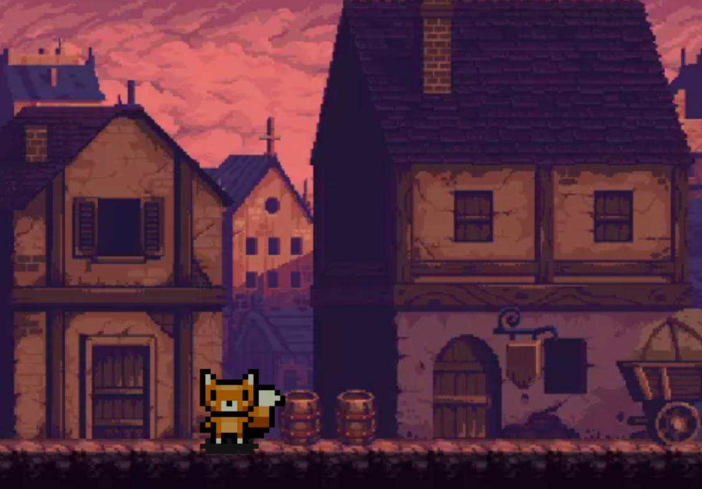

# Feral Forest

By

Fried Chicken

## Pitch

A platformer game, in which the player will be playing as a fox with the goal of beating an evil chicken final boss. When enemies are beaten rewards will be currency, chicken parts, chicken-based food, etc., playing on the fact that chickens are cannibalistic. The game will include 3 main levels/areas, including a mini boss on the last area. There will be three different kinds of enemies, and the final boss will be a bigger version of one of these. The enemies will be different types of chicken (or birds).The game will have a mysterious aesthetic but will also have an adventure element to it. 

## Settings/Area

The game will take place in a Ghost Town with three different levels/areas to explore in the town. The ghost town will be a southern-style, haunted area. The player starts out in the forest, then moves to the town itself. The environment assets will be partially from the asset store, and partially our own.

## Game Components

### Objects

Racoon Dog/Fox (main character)

Evil Chicken (final boss)

Chicken Mini Boss 1

Chicken Mini Boss 2

Chicken Mini Boss 3

Rewards

Platforms

Environment Objects

	Light poles, bushes, crates, barrels, etc 

### Attributes

* X & Y Position of Player and enemies
* X & Y Position of mouse
* Velocity of player and enemies
* AI state of enemy (resting, roaming, attacking, etc.)
* Movement state of players/enemies (idle, moving, dashing, attacking, etc.)
* Points?
* Current Save Point of Player
* Hit Points of Player and Enemies
* Player upgrades (boolean)
    * dash
    * double-jump
    * dash-attack
* Player upgrades (numeric)
    * Weapon level

### Relationships

* When left/right movement input is pressed, player moves left/rightWhen jump movement is pressed & player can jump, player character jumps
* Gravity constantly affects player and most enemies
* When a player interacts with a save point, it is set as their most recent save point
* When the player dies, they respawn at their most recent save point
* When the player interacts with an upgrade object, an animation plays and the character unlocks that upgrade
* When an enemy’s hit points reach zero, they despawn
* When the player dies, normal enemies respawn
* When the final boss is defeated, the game ends
* When a player enters another area, load that level

### Game Mechanics

In Feral Forest, the players are placed into a Ghost Town as a Racoon Dog/Fox. They can utilize WASD for movement, the E button for interactions in the town, shift for dash, and q for an additional combat ability. Left-click will be used for the player’s basic attack.

The goal is to collect as many points as possible and defeat the bosses. There will be 3 mini bosses alongside a final boss, in which all of them will be chickens. There will be various levels that the player will travel through, encountering enemies, and each area should be more difficult than the last and contain some sort of critical progression upgrade.

The game will include backtracking, as is a requirement for metroidvania games. I.e. the player will unlock a double jump in area 2, which lets them go back to area 1 and reach a previously inaccessible area, with valuable rewards.

The game ends when the final boss is defeated.

## Team Members/Experience

Pegah Tajvidi:

* 5 years coding experience, 2 years with c#

Dylan Michalak:

* 1 years Godot experience, 6 years of coding experience

Kaila Manangan:

* 3 years of basic game development experience, proficient art skills, & 4 years of coding experience

### Division of Labor

Pegah Tajvidi

* Level/System Design Lead - will be programming overall game design and organizing the levels

Dylan Michalak

* Player/Enemy Lead - in charge of player/enemy mechanics

Kaila Manangan 

* Art Lead - will be creating sprites and other visual elements

### Prototype Screenshot

